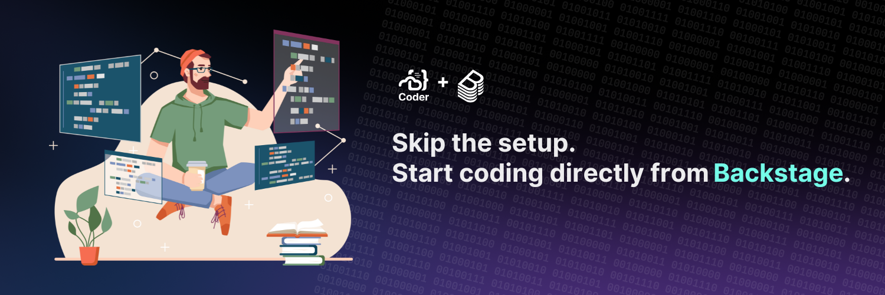

# Backstage Plugins

A collection of plugins that extend [Backstage](https://backstage.io) to help with developer onboarding, context switching, and automated IDEs (remote or local).

- [backstage-plugin-coder](./plugins/backstage-plugin-coder): Frontend plugin for integrating Coder workspaces with Backstage.
- [auth-backend-module-coder-provider](./plugins/auth-backend-module-coder-provider): Backend authentication module for Coder OAuth2 integration with Backstage's New Backend System.
- [backstage-plugin-devcontainers-backend](./plugins/backstage-plugin-devcontainers-backend): Backend plugin for integrating VS Code Dev Containers with Backstage catalog items (no Coder deployment necessary).
- [backstage-plugin-devcontainers-react](./plugins/backstage-plugin-devcontainers-react): Frontend plugin for detecting and working with Dev Containers repo data, letting you open repos in VS Code with a full Dev Containers setup (no Coder deployment necessary).

Please use [GitHub issues](https://github.com/coder/backstage-plugins/issues) to report any issues or feature requests.

## Contributing

To start the app:

```sh
yarn install
yarn dev
```

To run an individual plugin:

```sh
cd plugins/backstage-plugin-$name
yarn install
yarn start
```

Note that the Coder plugin does not support running like this as it currently
uses a backend proxy that is not available when running independently of the
Backstage app.

## Releasing

To draft a release for a plugin, push a tag using the format `<plugin-directory>/v<version>` where `<plugin-directory>` is the exact directory name under `plugins/`:

```sh
git tag -a backstage-plugin-coder/v0.0.0 -m "backstage-plugin-coder v0.0.0"
git push origin backstage-plugin-coder/v0.0.0
```

This will kick off an action that will create a draft release for the plugin.
Once you have reviewed the release you can publish it and another action will
publish the plugin to NPM.

## Support

Feel free to [open an issue](https://github.com/coder/backstage-plugins/issues/new) if you have questions, run into bugs, or have a feature request.

[Join our Discord](https://discord.gg/coder) to provide feedback on in-progress features, and chat with the community!

As always, you can also join the official [Backstage Discord](https://discord.gg/backstage-687207715902193673) to stay involved in their wonderful community.
