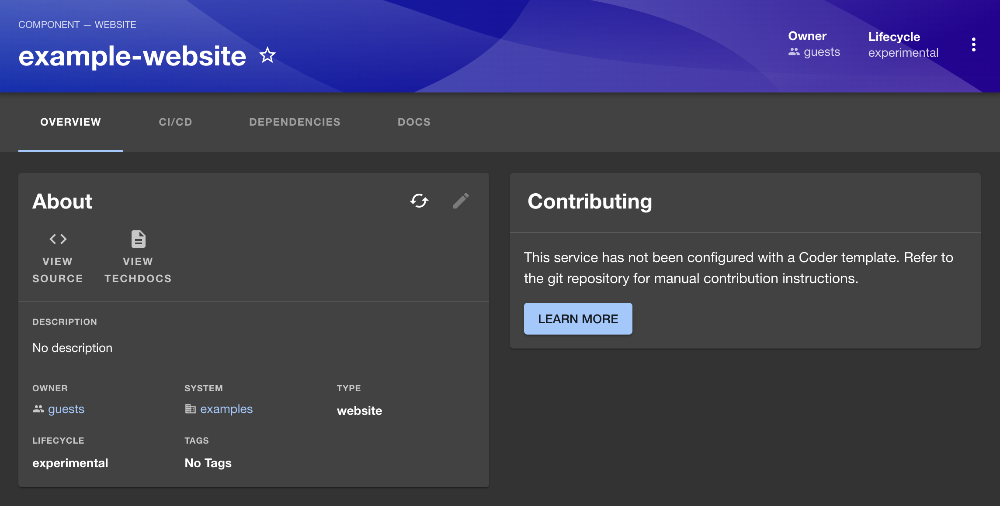
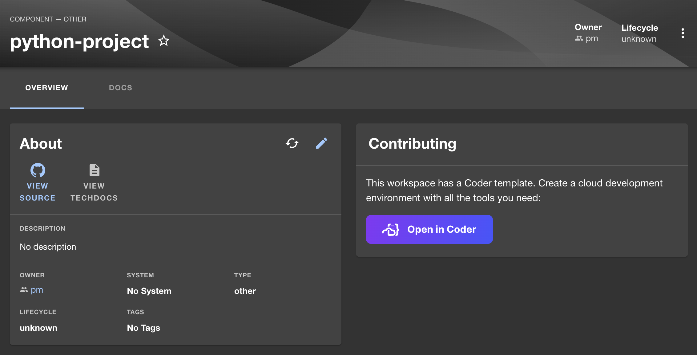

# coder-backstage

A basic plugin that adds the "Open in Coder" button to catalog items in backstage based on
the catalog spec.

| Catalog item without Coder                                       | Catalog item with Coder                                    |
| ---------------------------------------------------------------- | ---------------------------------------------------------- |
|  |  |

This is a very basic MVP, but demonstrates the power of a Coder+Backstage integration. It allows Backstage users to quickly develop a service inside a CDE.

## How it works

All backstage catalog items are git repos with a [catalog-info.yaml](https://github.com/bcdr-demos/python-project/blob/main/catalog-info.yaml) file. To add Coder compatibility to a given template, we need to add a `coder` section to the catalog-info.yaml file.

Here's an example:

```yaml
apiVersion: backstage.io/v1alpha1
kind: Component
metadata:
  name: python-project
spec:
  type: other
  lifecycle: unknown
  owner: pm
  coder:
    template: 'devcontainers'
    createMode: 'auto'
    params:
      repo: 'custom'
      repo_url: 'https://github.com/bcdr-demos/python-project'
      region: 'us-pittsburgh'
```

## Adding the component

Since the Backstage UI is "DIY," you'll need to modify `EntityPage.tsx` in your Backstage deployment to import the components from this plugin.

There are several ways to use the integration:

### Example Card

The easiest way to consume this integration is by importing the `ExampleContributingCard` component

```tsx
// EntityPage.tsx
import { ExampleContributingCard } from '@internal/plugin-coder';

// ...
const overviewContent = (
  <Grid container spacing={3} alignItems="stretch">
    {/* ... */}
    <Grid item md={6} xs={12}>
      <ExampleContributingCard coderAccessUrl="https://coder.example.com" />
    </Grid>
    {/* ... */}
  </Grid>
);
```

### Button

You can also just import the `OpenInCoderButton` component and use it in your own component.

### URL

For the most control, you can use the `useOpenInCoderLink` to get the Coder URL for a given catalog item.

```ts
// MyCustomComponent.tsx
import { useOpenInCoderLink } from '@internal/plugin-coder';

export const MyCustomComponent = () => {
  const coderLink = useOpenInCoderLink(catalogItem);
  // some basic component that has error handling if coderLink is null
  if (coderLink) return <a href={coderLink}>Open in Coder</a>;
  return <p>Not configured for Coder</p>;
};
```

## Taking this further

This is only the beginning. We can extend this integration further:

- [ ] Display Coder-compatible templates in the catalog
- [ ] Developing a neutral Backstage plugin to detect `devcontainer.json` in repos and add a more advanced "contributing" card that links to VS Code Remote, Codespaces, and Coder
- [ ] Allow developers to see their existing Coder workspaces and relate workspaces more directly to catalog items
- [ ] Allow developers to create new workspaces from the catalog item page or a dedicated sidebar page
- [ ] Build an IDE extension to allow people to see catalog items and start a new project, and open their CDE, without leaving their editor!

More ideas welcome!

## Contributing

Your plugin has been added to the example app in this repository, meaning you'll be able to access it by running `yarn start` in the root directory, and then navigating to [/coder](http://localhost:3000/coder).

You can also serve the plugin in isolation by running `yarn start` in the plugin directory.
This method of serving the plugin provides quicker iteration speed and a faster startup and hot reloads.
It is only meant for local development, and the setup for it can be found inside the [/dev](./dev) directory.
