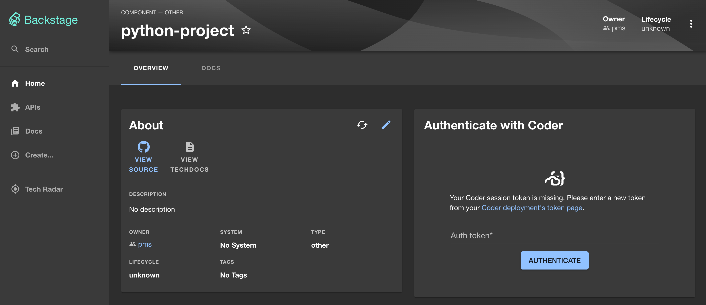
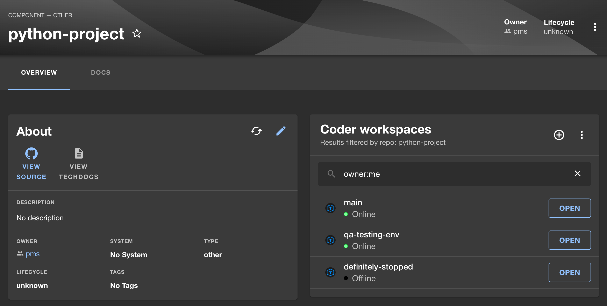

# Integrate Coder Workspaces into Backstage

Create and manage [Coder workspaces](https://coder.com/docs/v2/latest) from Backstage.

## Screenshots





## Features

- Users link their Coder accounts with Backstage via tokens
- Associate Coder workspaces with catalog items in Backstage
- Workspace list component for viewing and managing workspaces

## Setup

This assumes you already have a [Coder](https://github.com/coder/coder) deployment running.
Replace `https://coder.example.com` with your Coder deployment access URL. This also assumes
you have a template that has a parameter for a git repository URL (e.g. `git_repo_url`) that auto-clones
the repository or uses [envbuilder](https://coder.com/docs/v2/latest/templates/devcontainers) to build
the Dev Container.

1. If you have a standalone Backstage app (you didn't clone this repo), then do

   ```bash
   yarn --cwd packages/app add @coder/backstage-plugin-coder
   ```

2. Add the proxy key to your `app-config.yaml`:

   ```yaml
   proxy:
     endpoints:
       '/coder':
         # Replace with your Coder deployment access URL (add a trailing slash)
         target: 'https://coder.example.com/'

         changeOrigin: true
         allowedMethods: ['GET'] # Additional methods will be supported soon!
         allowedHeaders: ['Authorization', 'Coder-Session-Token']
         headers:
           X-Custom-Source: backstage
   ```

3. Add the `CoderProvider` to the application:

   ```tsx
   // packages/app/src/App.tsx

   import {
     type CoderAppConfig,
     CoderProvider,
   } from '@coder/backstage-plugin-coder';

   const appConfig: CoderAppConfig = {
     deployment: {
       accessUrl: 'https://coder.example.com',
     },

     // Set the default template (and parameters) for
     // catalog items. Individual properties can be overridden
     // by a repo's catalog-info.yaml file
     workspaces: {
       defaultTemplateName: 'devcontainers',
       defaultMode: 'manual',

       // This property defines which parameters in your Coder
       // workspace templates are used to store repository links
       repoUrlParamKeys: ['custom_repo', 'repo_url'],

       params: {
         repo: 'custom',
         region: 'eu-helsinki',
       },
     },
   };

   // ...

   export default app.createRoot(
     <CoderProvider appConfig={appConfig}>
       <AlertDisplay />
       <OAuthRequestDialog />
       <AppRouter>
         <Root>{routes}</Root>
       </AppRouter>
     </CoderProvider>,
   );
   ```

   **Note:** You can also wrap a single page or component with `CoderProvider` if you only need Coder in a specific part of your app. See our [API reference](./docs/README.md) (particularly the section on [the `CoderProvider` component](./docs/components.md#coderprovider)) for more details.

4. Add the `CoderWorkspacesCard` card to the entity page in your app:

   ```tsx
   // packages/app/src/components/catalog/EntityPage.tsx

   import { CoderWorkspacesCard } from '@coder/backstage-plugin-coder';

   // We recommend placing the component inside of overviewContent
   const overviewContent = (
     <Grid container spacing={3} alignItems="stretch">
       {entityWarningContent}
       <Grid item md={6}>
         <EntityAboutCard variant="gridItem" />
       </Grid>

       {/* Coder component should go inside Grid to help it work with MUI layouts */}
       <Grid item md={6} xs={12}>
         <CoderWorkspacesCard readEntityData />
       </Grid>

       {/* Other elements for overviewContent go here */}
     </Grid>
   );
   ```

### `catalog-info.yaml` files

In addition to the above, you can define additional properties on your specific repo's `catalog-info.yaml` file.

Example:

```yaml
apiVersion: backstage.io/v1alpha1
kind: Component
metadata:
  name: python-project
spec:
  type: other
  lifecycle: unknown
  owner: pms

  # Properties for the Coder plugin are placed here
  coder:
    templateName: 'devcontainers'
    mode: 'auto'
    params:
      repo: 'custom'
      region: 'us-pittsburgh'
```

You can find more information about what properties are available (and how they're applied) in our [`catalog-info.yaml` file documentation](./docs/catalog-info.md).

## Roadmap

This plugin is in active development. The following features are planned:

- [ ] Example component using the Coder API to make authenticated requests on behalf of the user
- [ ] Add support for only rendering component if `catalog-info.yaml` indicates the item is compatible with Coder
- [ ] OAuth support (vs. token auth) for linking Coder accounts
- [ ] "Open in Coder" button/card component for catalog items
- [ ] Example creating workspaces with Backstage Scaffolder
- [ ] Example dedicated "Coder" page in Backstage

## Contributing

This plugin is part of the Backstage community. We welcome contributions!
