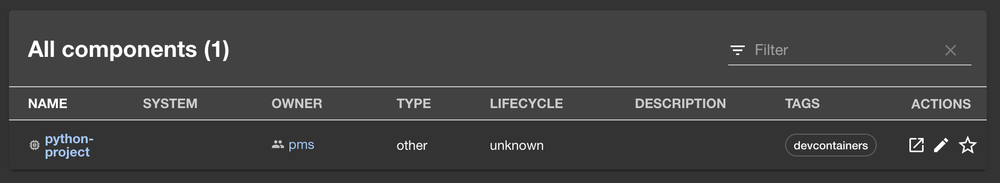

# @coder/backstage-plugin-devcontainers-backend

Automatically detect [development containers (Dev Container) files](https://containers.dev/) in your repositories on GitHub/GitLab/Bitbucket, and have Backstage automatically tag them in the background!

## Screenshots



## Features

_Note: While this plugin can be used standalone, it has been designed to be a backend companion to [`backstage-plugin-devcontainers-react`](../backstage-plugin-devcontainers-react/README.md)._

### Standalone features

- Automatically tag repos from GitHub/GitLab/Bitbucket that contain a `devcontainer.json` file
  - Repos are tagged as part of Backstage's [processing loop](https://backstage.io/docs/features/software-catalog/life-of-an-entity/#processing)

### When combined with the frontend plugin

- Provides an end-to-end solution for automatically adding/removing Dev Containers metadata in your Backstage installation, while letting you read them from custom hooks and components

## Setup

### Before you begin

Ensure that you have the following ready to go:

- A Backstage deployment that you can modify
- A GitHub/GitLab/Bitbucket repository that contains a `devcontainers.json` metadata file. [VS Code has a quick-start guide for adding devcontainers to a repo](https://code.visualstudio.com/docs/devcontainers/create-dev-container).

_Note: While this plugin has been developed and published by Coder, no Coder installations are required._

### Installation

1. From your Backstage deployment's `backend` directory, run the following command:
   ```shell
   yarn --cwd packages/backend add @coder/backstage-plugin-devcontainers-backend
   ```
2. Navigate to the `backend` directory's `catalog.ts` file
3. Import your source control manager provider of choice (Backstage has built-in support for GitHub, GitLab, and Bitbucket)

   ```ts
   export default async function createPlugin(
     env: PluginEnvironment,
   ): Promise<Router> {
     const builder = await CatalogBuilder.create(env);
     builder.addEntityProvider(
       GithubOrgEntityProvider.fromConfig(env.config, {
         id: 'production',
         orgUrl: 'https://github.com/coder',
         logger: env.logger,
         schedule: env.scheduler.createScheduledTaskRunner({
           frequency: { minutes: 60 },
           timeout: { minutes: 15 },
         }),
       }),
     );

     // Rest of implementation
   }
   ```

4. Import the `DevcontainersProcessor` class, and register it with your plugin creator:

   ```ts
   export default async function createPlugin(
     env: PluginEnvironment,
   ): Promise<Router> {
     const builder = await CatalogBuilder.create(env);
     builder.addEntityProvider(/* GitHub setup */);

     builder.addProcessor(
       DevcontainersProcessor.fromConfig(env.config, {
         tagName: 'example', // Defaults to devcontainers
         logger: env.logger,
         eraseTags: false,
       }),
     );

     // Add any extra processors and handle setup here
   }
   ```

5. As your provider of choice re-validates data and emits more entity information, `DevcontainersProcessor` will automatically intercept the data and append or remove tags, based on whether the current repository has a Dev Containers file! (See our API docs for more info on our [appending/removal process](./docs/classes.md#notes))

Full example:

```tsx
// catalog.ts
import { DevcontainersProcessor } from '@coder/backstage-plugin-devcontainers-backend';

export default async function createPlugin(
  env: PluginEnvironment,
): Promise<Router> {
  const builder = await CatalogBuilder.create(env);
  builder.addEntityProvider(
    GithubOrgEntityProvider.fromConfig(env.config, {
      id: 'production',
      orgUrl: 'https://github.com/coder',
      logger: env.logger,
      schedule: env.scheduler.createScheduledTaskRunner({
        frequency: { minutes: 60 },
        timeout: { minutes: 15 },
      }),
    }),
  );

  builder.addProcessor(new ScaffolderEntitiesProcessor());
  builder.addProcessor(
    DevcontainersProcessor.fromConfig(env.config, {
      logger: env.logger,
      eraseTags: false,
    }),
  );

  const { processingEngine, router } = await builder.build();
  await processingEngine.start();
  return router;
}
```

## Limitations

### Search limitations

This plugin lets the user decide how to bring in repository data. As such, the plugin is limited by (1) what data your Backstage repo provider is able to detect, and (2) what API calls your source control manager supports.

Basic Dev Containers support has been tested for GitHub, GitLab, and Bitbucket, using their default Backstage data providers. All three are able to detect a Dev Container config file, as long as the file is located in a supported location, as defined by [the official Dev Containers specification](https://containers.dev/implementors/spec/#devcontainerjson).

Other providers can be used, but are not guaranteed to work out of the box. In addition, not all source control managers provide an API for searching for deeply-nested files. In some cases, only the first two Dev Container config locations will be detectable.

We are happy to expand support for other source control managers, though. If you have a specific use case you'd like our help with, feel free to open a new issue!

### VS Code limitations

At present, the official [Visual Studio Remote Development extensions](https://github.com/microsoft/vscode-remote-release) do not support branches other than `/tree/main`. As such, trying to open a VS Code link that is configured with a non-`main` branch may error out. Please see Microsoft's [open issue for expanding support](https://github.com/microsoft/vscode-remote-release/issues/4296).

## API documentation

Please see the [directory for our API references](./docs/README.md) for additional information.

## Contributing

This plugin is part of the Backstage community. We welcome contributions!
