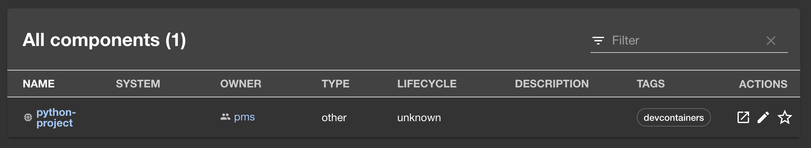
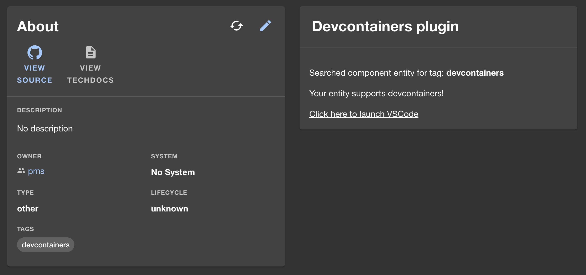
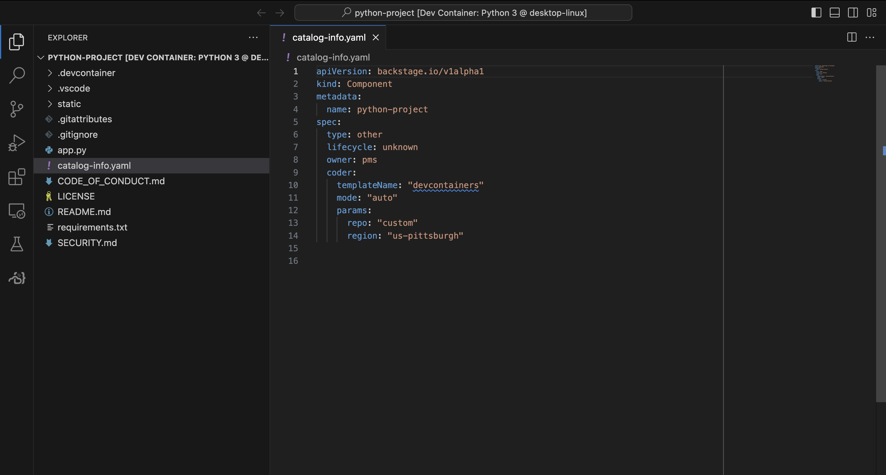

# Go straight from Backstage to your editor with Dev Containers

Automatically launch fully-contained dev environments with [development containers (devcontainers)](https://containers.dev/), right from Backstage!

## Screenshots





## Features

_Note: While this plugin can be used standalone, it has been designed to be a frontend companion to [`backstage-plugin-devcontainers-backend`](../backstage-plugin-devcontainers-backend/README.md)._

### Standalone features

- Custom hooks for reading your special Dev Container metadata tag inside your repo entities, and providing ready-made links to opening that repo in VS Code

### When combined with the backend plugin

- Provides an end-to-end solution for automatically adding/removing Dev Containers metadata in your Backstage installation, while letting you read them from custom hooks and components

## Setup

This section will walk you through adding the plugin to your Backstage deployment.

### Before you begin

Ensure that you have the following ready to go:

- A Backstage deployment that you can modify
- A GitHub/GitLab/Bitbucket repository that contains a `devcontainers.json` file. [VS Code has a quick-start guide for adding Dev Containers to a repo](https://code.visualstudio.com/docs/devcontainers/create-dev-container)
- [Docker](https://docs.docker.com/get-docker/) installed and running locally on your machine

_Note: While this plugin has been developed and published by Coder, no Coder installations are required._

### Installation

1. From your Backstage deployment's directory, run the following command:
   ```shell
   yarn --cwd packages/app add @coder/backstage-plugin-devcontainers-react
   ```
2. Navigate to the `app` directory's `EntityPage.tsx` file
3. Add the `DevcontainersProvider` component, as well as any inputs:

   ```tsx
   import {
     type DevcontainersConfig,
     DevcontainersProvider,
   } from '@coder/backstage-plugin-devcontainers-react';

   // The value of tagName must match the tag value that
   // backstage-plugin-devcontainers-backend is configured with
   const devcontainersConfig: DevcontainersConfig = {
     tagName: 'devcontainers',
   };

   // Example usage - you can place the component in other page
   // views as well
   const overviewContent = (
     <Grid container spacing={3} alignItems="stretch">
       {entityWarningContent}
       <Grid item md={6}>
         <EntityAboutCard variant="gridItem" />
       </Grid>

       <Grid item md={6} xs={12}>
         <DevcontainersProvider config={devcontainersConfig}>
           {/* Content that uses Dev Containers goes here */}
         </DevcontainersProvider>
       </Grid>

       <Grid item md={6} xs={12}>
         <CoderWorkspacesCard readEntityData />
       </Grid>
     </Grid>
   );
   ```

4. If you are trying out the Dev Containers functionality, we provide a pre-made `ExampleDevcontainersComponent`. You can include it like so:

   ```tsx
   // Update imports
   import {
     type DevcontainersConfig,
     DevcontainersProvider,
     ExampleDevcontainersComponent,
   } from '@coder/backstage-plugin-devcontainers-react';

   // ExampleDevcontainers must be inside DevcontainersProvider,
   // but it does not need to be a direct child
   <DevcontainersProvider config={devcontainersConfig}>
     <YourCustomWrapperComponent>
       <ExampleDevcontainersComponent />
     </YourCustomWrapperComponent>
   </DevcontainersProvider>;
   ```

5. If you are looking to create your own components, you can import the `useDevcontainers` custom hook.

   ```tsx
   // Inside your custom component's file
   import { useDevcontainers } from '@coder/backstage-plugin-devcontainers-react';

   export const YourComponent = () => {
     const state = useDevcontainers();

     return (
       {state.hasUrl ? (
         <>
           <p>Your entity supports Dev Containers!</p>
           <a href={state.vsCodeUrl}>Click here to launch VS Code</a>
         </>
       ) : (
         <p>No Dev Containers plugin tag detected</p>
       )}
     );
   };

   // Inside EntityPage.tsx
   <DevcontainersProvider config={devcontainersConfig}>
     <YourComponent />
   </DevcontainersProvider>;
   ```

6. When you click a link to open a Dev Container inside VS Code, you will be prompted to install the official [VS Code Dev Containers extension](https://marketplace.visualstudio.com/items?itemName=ms-vscode-remote.remote-containers) if you don't have it already.

Have an idea for what kinds of components you would like to see? Feel free to open an issue and make a feature request!

## Limitations

While this does not directly apply to the React plugin, there are limits around the backend plugin's support of `devcontainer.json` files. Please see the [backend plugin's README](../backstage-plugin-devcontainers-backend/README.md#limitations) for more information.

## API documentation

Please see the [directory for our API references](./docs/README.md) for additional information.

## Contributing

This plugin is part of the Backstage community. We welcome contributions!
